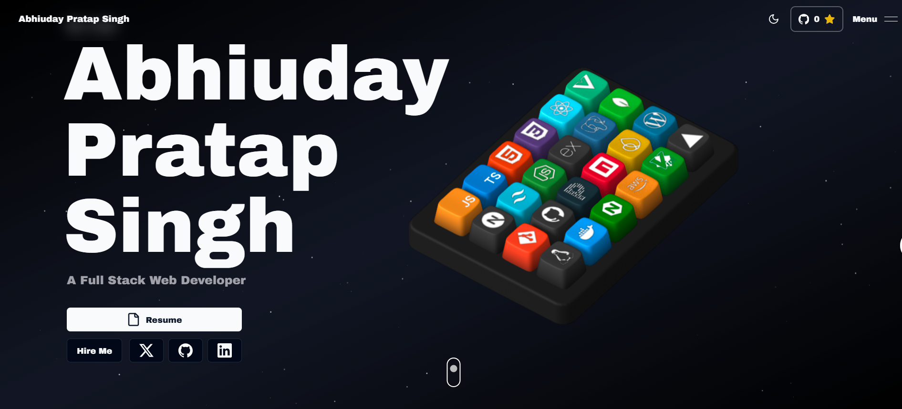

# 3D Portfolio

This is a personal developer portfolio built with Next.js, TypeScript, and Tailwind CSS.

It showcases projects, skills, experience, and contact details with interactive UI and smooth animations. The main highlight is a 3D keyboard section where each keycap represents a skill.

## Landing Page Preview

## About The Portfolio

- Built as a modern single-page portfolio experience.
- Includes project showcase, blogs, certificates, and contact form.
- Uses motion and visual effects for a polished presentation.
- Fully responsive and works on desktop and mobile.

## Tech Stack

- Next.js 14
- React 18
- TypeScript
- Tailwind CSS
- Framer Motion
- GSAP
- Spline Runtime

## How To Run

1. Clone the project:

   git clone https://github.com/Abhiuday02/Portfolio.git
   cd 3d-portfolio

2. Install dependencies:

   pnpm install

3. Create environment file:

   Copy .env.example to .env.local and fill values.

4. Start development server:

   pnpm dev

5. Open the app:

   http://localhost:3000

## Build For Production

- Build:

  pnpm build

- Start:

  pnpm start
